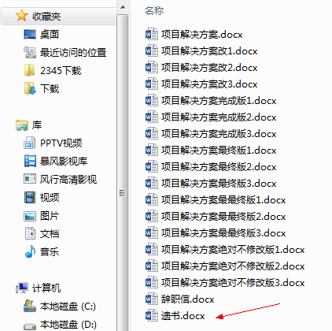
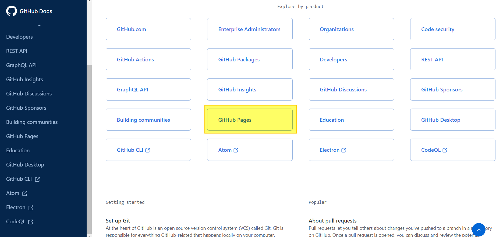
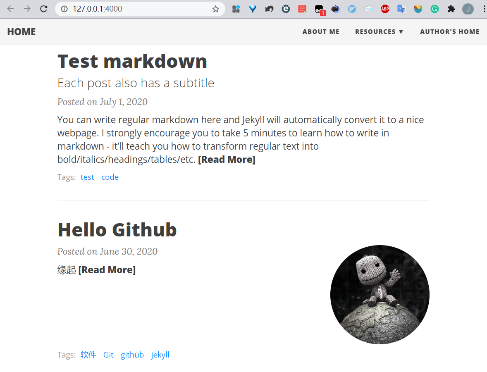

- [缘起](#缘起)
- [Git](#git)
- [Github](#github)
- [Jekyll](#jekyll)

---

## 缘起

可能我自己也没有想到，过去偶尔会冒出的想拥有一个自己的小小网站想法会在`github` 上实现. 贸然闯入[Github](https://github.com/)这个程序员们的网上圣坛,缘起一次在公司里 **google**如何做流程文档的版本控制。公司虽然也有文控工具，但只能追踪到不同的文件版本，对于不同版本文件的内容差异就无能为力了，特别是你已经改了N多版本，老板却说我们回到以前的某个Idea吧，看着早已改的面目全非的文件你是不是要崩溃！！！借用一下网上流传的图，体会一下什么是绝望。。。



## [Git](https://git-scm.com/)

我还年轻，世界那么大，还想去看看。google搜索出来版本控制最流行的软件是Git(也是大名鼎鼎的Linux之父Linus Torvalds 创造的，据说是不满现有的版本控制软件，花了一个星期就写出了GIT，迅速风靡世界，膜拜大神！）。

引用某度的简介:

>Git --- The stupid content tracker, 傻瓜内容跟踪器。Linus Torvalds 是这样给我们介绍 Git 的。
Git 是用于 Linux内核开发的版本控制工具。与常用的版本控制工具 CVS, Subversion 等不同，它采用了分布式版本库的方式，不必服务器端软件支持（wingeddevil注：这得分是用什么样的服务端，使用http协议或者git协议等不太一样。并且在push和pull的时候和服务器端还是有交互的。），使源代码的发布和交流极其方便。 Git 的速度很快，这对于诸如 Linux kernel 这样的大项目来说自然很重要。 Git 最为出色的是它的合并跟踪（merge tracing）能力。

既然有这么好的工具，当然要用喽，然后一头掉在了git这个大坑里。。。


`Git` 是程序员们不得不过的一个坎，对专业人士都是一个坎，更别说我们这些门外汉了，[Git](https://git-scm.com/)官方文档看的是一个头两个大, 总结了一个经验，或者说教训更贴切一些：

> 对于复杂的事物，最简单实用的入门方法是看它的`Quick Start`(快速入门)，而不是去啃厚厚的一本使用说明书。

当你入门后，再去看官方文档，比网上传来传去的不知真假新旧的内容要权威准确的多，官方还有比较系统的`Q&A`和论坛, 你的问题一般都会找到答案. 网上搜了很多入门文章，还发现了一个大神的网站有专门的Git教程[廖雪峰的官方网站](https://www.liaoxuefeng.com/).

哈哈，史上最经典的Git入门教程赫然在列，想想自己掉了那么多坑才遇到它，全是泪。。。强烈建议想入门git的小白们直接从廖大神的教程开始！


## [Github](https://github.com/)

入门了Git命令，自然要去[Github](https://github.com/)注册一个账户~~去围观一下大神们~~去海淘那些神一样的工具！（比如 **[12306](https://github.com/testerSunshine/12306)**抢票神器，~~翻**墙~~ [科学上网](https://github.com/bannedbook/fanqiang),居然还有[浙江大学课程攻略共享计划](https://github.com/QSCTech/zju-icicles)!! 虽然没有上过大学，不过并不影响我对一流大学的神往，嗯，只是神往，不是羡慕忌妒恨,更不是心碎,真的。。。 ）

>GitHub是一个面向开源及私有软件项目的托管平台，因为只支持Git作为唯一的版本库格式进行托管，故名GitHub. 

在看[Github](https://github.com/)官方文档的时候我发现旗下一款产品 **Github Pages**, 可以简单的建立一个自己的产品或博客网站.




说简单其实是相对自己搭服务器写代码而言的，套用Jekyll模板的话还是比较容易入手的.

## [Jekyll](https://jekyllrb.com/)

官网的搭建说明就四条命令一个空白博客模板就建成了，但我们一般会从github上clone自己喜欢的模板。


下面是**[Jekyll官网的中文翻译网站](http://jekyllcn.com/)**，可能不是最新，但没有语言障碍，能够快速入手。


Jekyll 是一个静态博客工具，写一个简单`MarkDown`格式的文件,比如这篇短文，就可以自动生成博客。如果直接在`github`网站上写作的话，操作比较简单。只是第一要有网络，第二如果有修改，要等十来分钟后才能看到更新的网页，有点麻烦。如果想要实时预览更新效果，就需要搭建一个`Jekyll`调试环境，在Windows上搭建这个环境遇到了不少坑，Linux上搭建会容易的多，主要是网络服务器这块本就是Linux的强项，所以功能丰富而稳定。如何搭建请自行google或Baidu入门教程，有些谱了再看上面的中文官方教程查漏补缺。

```
# Windows上搭建完Jekyll调试环境后，可以运行一下下面的命令检查一下功能，能看到程序的版本信息就说明这个程序安装好了：

PS C:\Users\xxxx> ruby --version
ruby 2.7.1p83 (2020-03-31 revision a0c7c23c9c) [x64-mingw32]

PS C:\Users\xxxx> bundle --version
Bundler version 2.1.4

PS C:\Users\xxxx> jekyll --version
jekyll 4.1.0

# 进入本地的博客文件夹，查看一下
PS C:\Users\xxxx> cd .\code\xxxx.github.io\
PS C:\Users\xxxx\code\xxxx.github.io> ls


    目录: C:\Users\xxxx\code\xxxxx.github.io


Mode                 LastWriteTime         Length Name
----                 -------------         ------ ----
d-----          2020/4/5     15:07                .github
d-----          2020/7/8     20:11                .vscode
d-----          2020/7/8     21:50                css
d-----          2021/5/2     19:08                img
d-----          2020/7/8     21:50                js
d-----          2020/4/5     15:07                _data
d-----         2020/7/19      9:51                _drafts
d-----          2020/7/8     21:50                _includes
d-----          2020/7/8     21:50                _layouts
d-----          2021/5/2     16:02                _posts
d-----          2021/5/2     16:01                _site
-a----          2020/7/8     20:11            581 .Gemfile.un~
-a----          2020/4/5     15:07            750 .gitattributes
-a----          2020/7/8     21:50             80 .gitignore
-a----          2020/7/8     21:50            256 404.html
-a----          2020/7/8     21:50            226 aboutme.md
-a----          2020/4/5     15:07           2902 CHANGELOG.md
-a----          2020/7/8     21:50            159 Dockerfile
-a----          2020/4/5     15:07              2 draw
-a----          2020/4/5     15:07            966 feed.xml
-a----         2020/7/10     21:20            199 Gemfile
-a----         2020/7/10     21:25           6877 Gemfile.lock
-a----          2020/7/8     20:11            209 Gemfile~
-a----          2020/7/8     21:50           1963 index.html
-a----          2020/7/8     21:50           1281 LICENSE
-a----          2020/7/8     21:50          27461 README.md
-a----          2020/4/5     15:07           3937 staticman.yml
-a----          2020/4/5     15:07           1138 tags.html
-a----          2020/7/8     21:50           7254 _config.yml

# 把写完或修改完的markdown格式的文章copy到“_posts"文件夹（直接在这个文件夹里新建markdown文件更简单），运行下面的生成网页命令

PS C:\Users\ttpc2\code\xxxx.github.io> bundle exec jekyll serve

# 会输出一些信息
Configuration file: C:/Users/xxxx/code/xxxx.github.io/_config.yml
C:/Ruby27-x64/lib/ruby/gems/2.7.0/gems/pathutil-0.16.2/lib/pathutil.rb:497: warning: Using the last argument as keyword parameters is deprecated
            Source: C:/Users/xxxx/code/xxxx.github.io
       Destination: C:/Users/xxxx/code/xxxx.github.io/_site
 Incremental build: disabled. Enable with --incremental
      Generating...
C:/Ruby27-x64/lib/ruby/gems/2.7.0/gems/jekyll-3.7.4/lib/jekyll/convertible.rb:43: warning: Using the last argument as keyword parameters is deprecated

                    done in 2.795 seconds.
  Please add the following to your Gemfile to avoid polling for changes:
    gem 'wdm', '>= 0.1.0' if Gem.win_platform?
 Auto-regeneration: enabled for 'C:/Users/xxxx/code/xxxx.github.io'
    Server address: http://127.0.0.1:4000
  Server running... press ctrl-c to stop.
```

​    拷贝 <http://127.0.0.1:4000> 到你的浏览器地址栏，回车就可以看到你自己的博客啦!




