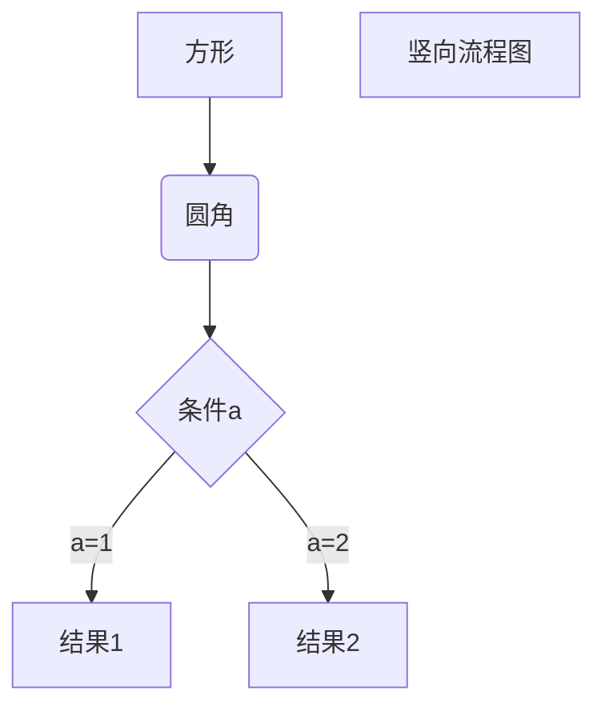
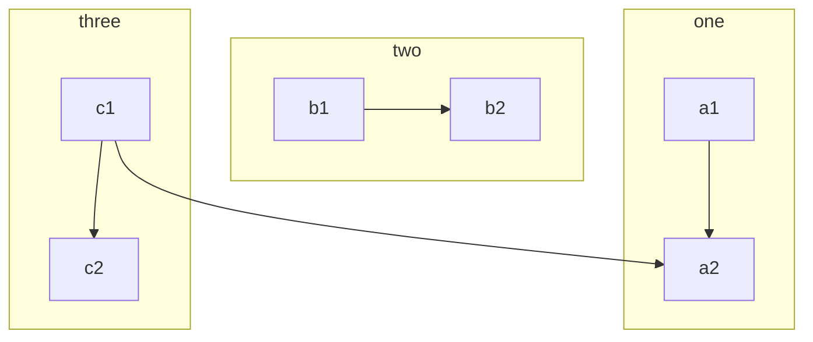
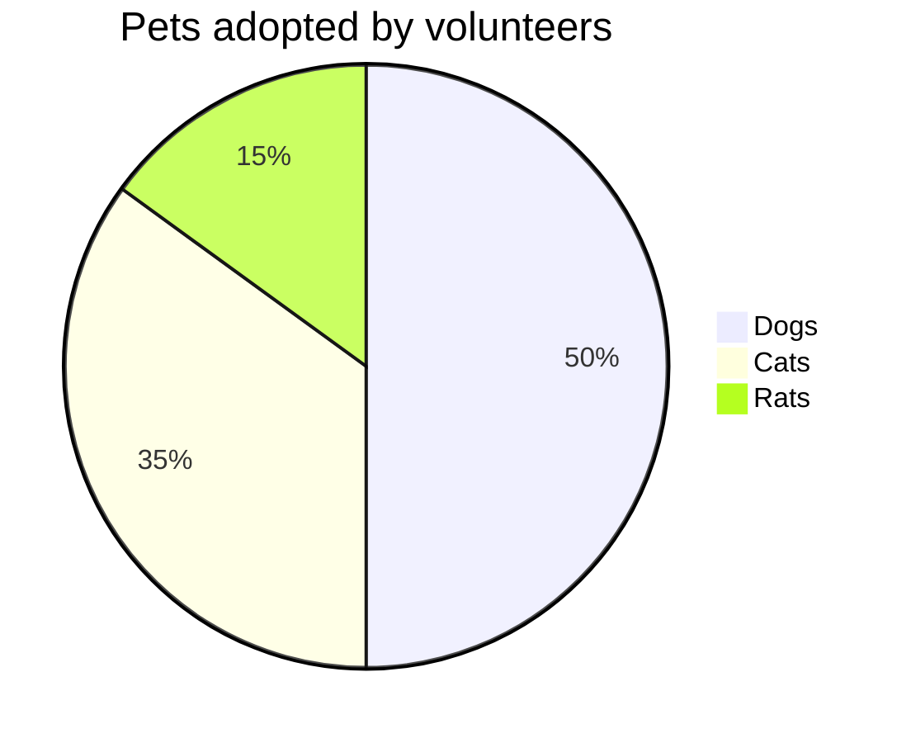
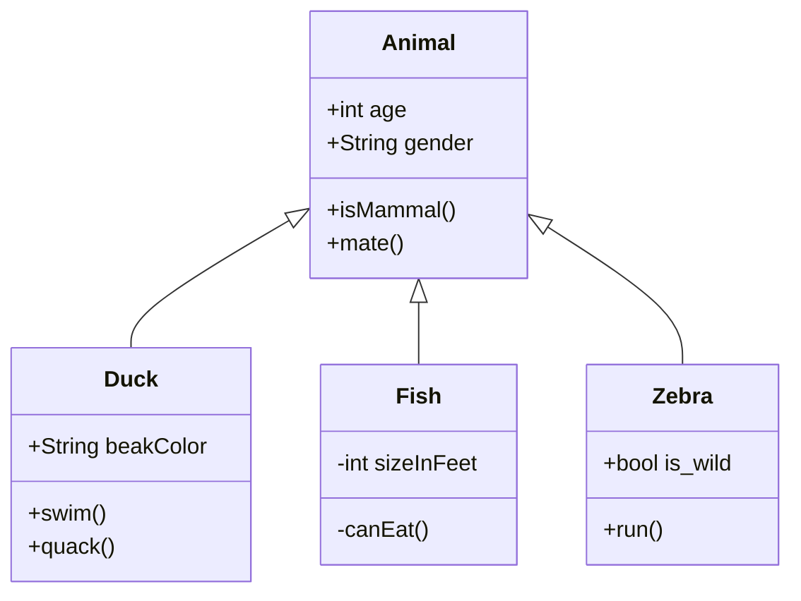
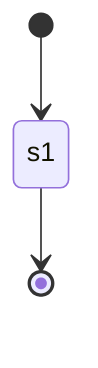
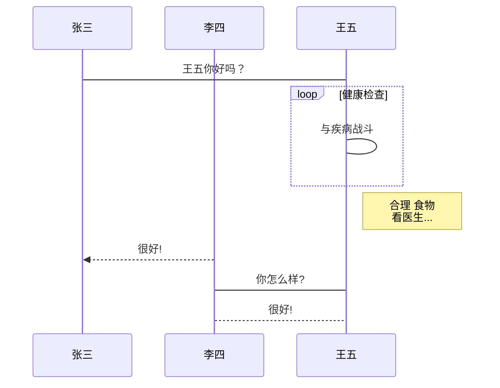
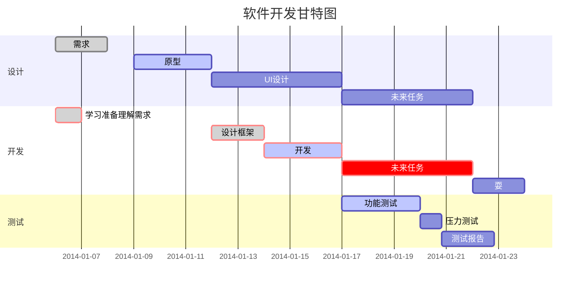
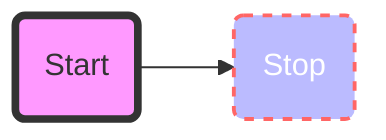
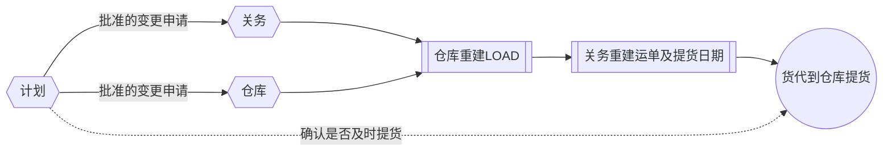

**Markdown**的画图扩展语法方面**Mermaid**已经一统六国，不建议在其它小众的画图语法上浪费时间

```
<script src="/js/mermaid.min.js"></script>
<div class="mermaid">


graph TD
    A(Java)
    B(Java se)
    C(Java ee)
    D(Java me)
    A-.->B
    A-.->C
    A-.->D
    classDef className fill:#f9f,stroke:#333,stroke-width:4px;
    class B,C,D className;
    style A fill:#ccf,stroke:#f66,stroke-width:2px,stroke-dasharray: 5, 5

</div>
```


## Mermaid 流程图

| 语法        | 名称(功能)   | 方法(示例)                    |
| :---------- | :----------- | :---------------------------- |
| graph LR/TD | 声明         | 横向制图用"LR" 纵向制图用"TD" |
| id[alt]     | 直角矩形     | id[alt]                       |
| id(alt)     | 圆角矩形     | id(alt)                       |
| id{alt}     | 菱形(结点)   | id{alt}                       |
| –>          | 事件线(实线) | 对象a–>对象b                  |

1.**横向流程图源码格式**：

```text
graph LR
A[方形] -->B(圆角)
    B --> C{条件a}
    C -->|a=1| D[结果1]
    C -->|a=2| E[结果2]
    F[横向流程图]
```

<script src="/js/mermaid.min.js"></script>
<div class="mermaid">
graph LR
A[方形] -->B(圆角)
    B --> C{条件a}
    C -->|a=1| D[结果1]
    C -->|a=2| E[结果2]
    F[横向流程图]
</div>

2.**横向流程图源码格式**：

```text
graph TD
A[方形] --> B(圆角)
    B --> C{条件a}
    C --> |a=1| D[结果1]
    C --> |a=2| E[结果2]
    F[竖向流程图]
```


<div class="mermaid">

</div>

3. 纵向子图

```text
graph TB
    c1-->a2
    subgraph one
    a1-->a2
    end
    subgraph two
    b1-->b2
    end
    subgraph three
    c1-->c2
    end
```

<div class="mermaid">

</div>

4. 饼图

| 语法  | 名称(功能) | 方法(示例)                                                   |
| :---- | :--------- | :----------------------------------------------------------- |
| pie   | 声明       | 段首声明                                                     |
| title | 标题       | title 标题x                                                  |
| " " : | 描述       | “部分a”: <数量> “部分b”: <数量> “部分c”: <数量> “部分d”: <数量> ??只需填入数量, 百分比是Mermaid自动求解的 |

```text
pie 
   title Pets adopted by volunteers
       "Dogs" : 500
       "Cats" : 350
       "Rats" : 150

```


<div class="mermaid">

</div>

5. **类图**

语法解释：`<|--` 表示继承，`+` 表示 `public`，`-` 表示 `private`，学过 Java 的应该都知道。

| 语法            | 名称(功能)         | 方法(示例)                          |
| :-------------- | :----------------- | :---------------------------------- |
| classDiagram    | 声明               | 段首声明                            |
| <\|–            | 带箭头的连线(实线) | 类a <\|-- 类b                       |
| 主类名 :        | 定义主类里面的内容 | 类a : 内容1 类a : 内容2 类a : 内容3 |
| class 类名称{ } | 定义子类里面的内容 | class 类b{ 内容1 内容2 内容3 }      |

```text
classDiagram
      Animal <|-- Duck
      Animal <|-- Fish
      Animal <|-- Zebra
      Animal : +int age
      Animal : +String gender
      Animal: +isMammal()
      Animal: +mate()
      class Duck{
          +String beakColor
          +swim()
          +quack()
      }
      class Fish{
          -int sizeInFeet
          -canEat()
      }
      class Zebra{
          +bool is_wild
          +run()
      }
```

<div class="mermaid">

</div>

6. 状态图

语法解释：`[*]` 表示开始或者结束，如果在箭头右边则表示结束。

| 语法         | 名称(功能)   | 方法(示例)                      |
| :----------- | :----------- | :------------------------------ |
| stateDiagram | 声明         | 段首声明                        |
| [*]          | 状态点       | [*]–>对象a                      |
| –>           | 连接线(实线) | 对象a–>对象b (对象可以是状态点) |

```text
stateDiagram
    [*] --> s1
    s1 --> [*]
```


<div class="mermaid">

</div>


7、UML标准时序图样例：

| 语法            | 名称(功能)         | 方法(示例)             |
| :-------------- | :----------------- | :--------------------- |
| sequenceDiagram | 声明               | 段首声明用             |
| ->> :           | 事件线(实线)       | 对象a->>对象b:事件文本 |
| alt             | 情况替换文本       | alt 条件/情况          |
| else            | (其他)情况替换文本 | else 条件/情况         |
| opt             | 选择性文本         | opt 条件/情况          |
| end             | 结束(声明)         | 段尾结束               |
| %%              | 注释               |                        |

```text
%% 时序图例子,-> 直线，-->虚线，->>实线箭头
  sequenceDiagram
    participant 张三
    participant 李四
    张三->王五: 王五你好吗？
    loop 健康检查
        王五->王五: 与疾病战斗
    end
    Note right of 王五: 合理 食物 <br/>看医生...
    李四-->>张三: 很好!
    王五->李四: 你怎么样?
    李四-->王五: 很好!
```

<div class="mermaid">

</div>

8、甘特图样例：

| 语法       | 名称(功能)                                | 方法(示例)                                                   |
| :--------- | :---------------------------------------- | :----------------------------------------------------------- |
| gantt      | 类型声明                                  | 段首声明                                                     |
| dateFormat | 时间格式                                  | dateformat: YYYY-MM-DD datefomat: MM-DD-YYYY etc(更多的格式查看??**Mermaid甘特图文档**) |
| title      | 甘特图标题                                | title xx项目管理表                                           |
| section    | 项目名称(分区)                            | section 项目1                                                |
| :done      | 完成(状态)                                | 事件1 :done, …                                               |
| :active    | 正在进行(状态)                            | 事件1 :active, …                                             |
| :crit      | **c**ritical, 关键任务                    | 事件1 :crit, …                                               |
| des        | **d**escription, 任务描述(指针或者选择器) | des, <对项目事件的时间描述>                                  |

```text
%% 语法示例
        gantt
        dateFormat  YYYY-MM-DD
        title 软件开发甘特图
        section 设计
        需求                      :done,    des1, 2014-01-06,2014-01-08
        原型                      :active,  des2, 2014-01-09, 3d
        UI设计                     :         des3, after des2, 5d
    未来任务                     :         des4, after des3, 5d
        section 开发
        学习准备理解需求                      :crit, done, 2014-01-06,24h
        设计框架                             :crit, done, after des2, 2d
        开发                                 :crit, active, 3d
        未来任务                              :crit, 5d
        耍                                   :2d
        section 测试
        功能测试                              :active, a1, after des3, 3d
        压力测试                               :after a1  , 20h
        测试报告                               : 48h
```

<div class="mermaid">

</div>

9. 图形着色（过于复杂，效率低下）

```text
graph LR
    id1(Start)-->id2(Stop)
    style id1 fill:#f9f,stroke:#333,stroke-width:4px
    style id2 fill:#bbf,stroke:#f66,stroke-width:2px,color:#fff,stroke-dasharray: 5 5
```

<div class="mermaid">

</div>


###  Mermaid流程图练习

<div class="mermaid">

</div>


---


## Typora支持的Markdown画图语法（不建议使用）

** Typora 内建支持两种图，流程图和时序图，语法相对Mermaid也并不简单，建议直接使用Mermaid,简单，强大，通用。


1. 标准流程图源码格式：

| 语法             | 名称(功能)   | 方法(示例)                                                   |
| :--------------- | :----------- | :----------------------------------------------------------- |
| st=>start:       | 开始         | st=>start: 开始                                              |
| op=>operation:   | 选项         | op=>operation: 行为                                          |
| cond=>condition: | 条件         | cond=>condition: 是/否?                                      |
| e=>end           | 结束         |                                                              |
| ->               | 事件线(直线) | st->op->cond cond(**yes**)->e cond(**no**)->op ??cond()的参数似乎必须是"yes"和"no" |

```flow
st=>start: 开始框
op=>operation: 处理框
cond=>condition: 判断框(是或否?)
sub1=>subroutine: 子流程
io=>inputoutput: 输入输出框
e=>end: 结束框
st->op->cond
cond(yes)->io->e
cond(no)->sub1(right)->op
```
2. 标准流程图源码格式（横向）：

```flow
st=>start: 开始框
op=>operation: 处理框
cond=>condition: 判断框(是或否?)
sub1=>subroutine: 子流程
io=>inputoutput: 输入输出框
e=>end: 结束框
st(right)->op(right)->cond
cond(yes)->io(bottom)->e
cond(no)->sub1(right)->op
```
3. UML时序图源码样例：

| 语法                 | 名称(功能)   | 方法(示例)                               |
| :------------------- | :----------- | :--------------------------------------- |
| -> :                 | 事件线(实线) | 对象a -> 对象b :                         |
| –> :                 | 事件线(虚线) | 对象a --> 对象b :                        |
| note left/right of : | 备注         | note left of 对象a: note right of 对象b: |

```sequence
对象A->对象B: 对象B你好吗?（请求）
Note right of 对象B: 对象B的描述
Note left of 对象A: 对象A的描述(提示)
对象B-->对象A: 我很好(响应)
对象A->对象B: 你真的好吗？
```
4. UML时序图源码复杂样例：

```sequence
Title: 标题：复杂使用
对象A->对象B: 对象B你好吗?（请求）
Note right of 对象B: 对象B的描述
Note left of 对象A: 对象A的描述(提示)
对象B-->对象A: 我很好(响应)
对象B->小三: 你好吗
小三-->>对象A: 对象B找我了
对象A->对象B: 你真的好吗？
Note over 小三,对象B: 我们是朋友
participant C
Note right of C: 没人陪我玩
```

###  Typora Markdown扩展语法练习

```flow
st=>start: 收料开始
op=>operation: 检查来料单据
cond1=>condition: 是否有报关单送货单？
cond2=>condition: 单据与实物是否一致
op1=>operation: 双方签字
e=>end: 收料结束

st->op->cond1->cond2->op1->e
cond1(yes)->cond2
cond1(no)->op
cond2(yes)->op1
cond2(no)->op

```


<参考>:<https://www.codenong.com/cs106212765/>
